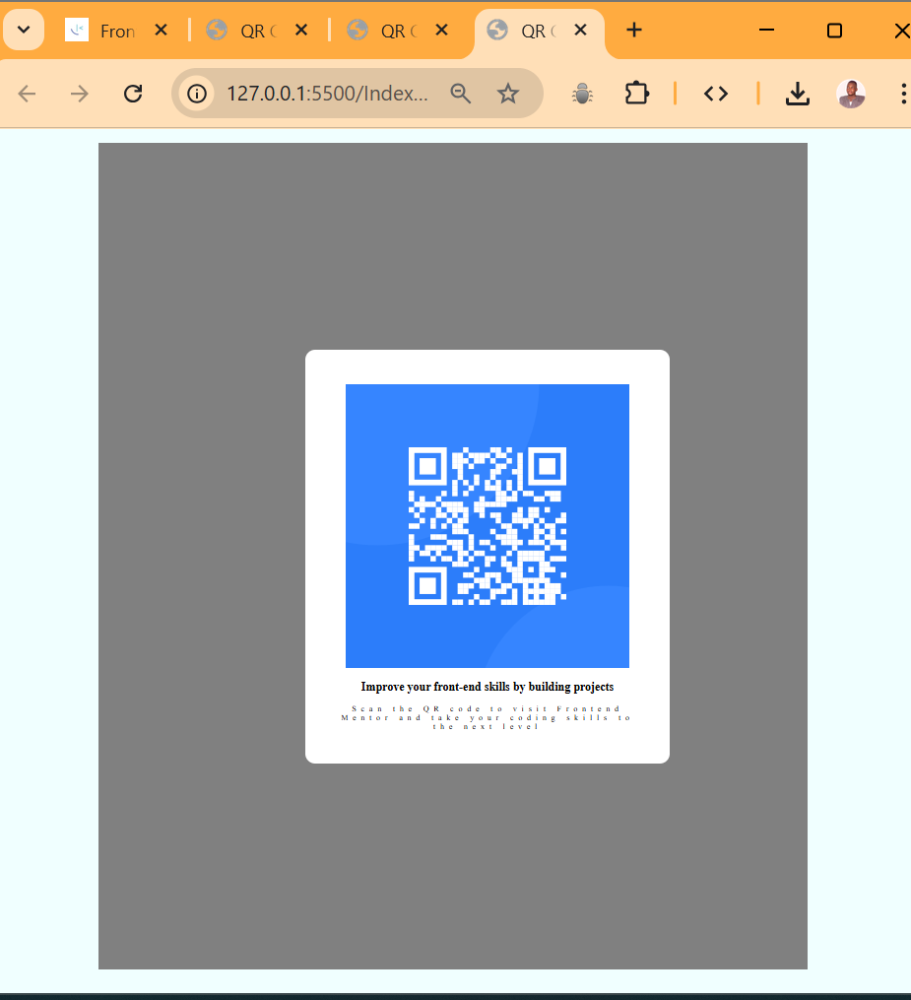

# Frontend Mentor - QR code component solution

This is a solution to the [QR code component challenge on Frontend Mentor]

## Table of contents

  - [Screenshot](#screenshot)
  - [Links](#links)
  - [Built with](#built-with)
- [Author](thomas1-dev)

**Note: Delete this note and update the table of contents based on what sections you keep.**

## Overview

### Screenshot

### Links

- Solution URL: [Add solution URL here](https://your-solution-url.com)
- Live Site URL: [Add live site URL here](https://your-live-site-url.com)

## My process

### Built with

- Semantic HTML5 markup
- CSS custom properties
- Flex
- CSS Grid

- [Styled Components](href="style.css) - For styles

## Author

- Website - [thomas1-dev](https://www.your-site.com)
